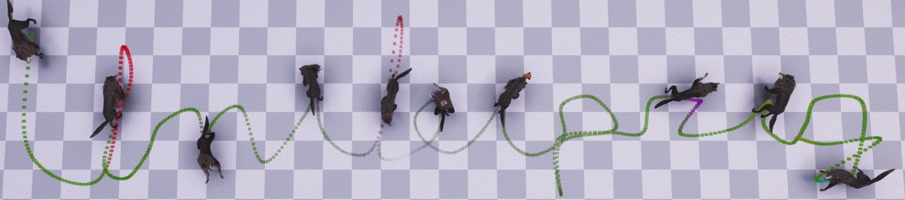

<h3>Animation Authoring for Neural Quadruped Controller </h3>

<a href="https://github.com/pauzii">Paul Starke</a>+,
<a href="https://www.linkedin.com/in/sebastian-starke-b281a6148/">Sebastian Starke</a>,
<a href="https://www.linkedin.com/in/taku-komura-571b32b/">Taku Komura</a>,
Gerik Scheuermann,
Daniel Wiegreffe.
Bachelor Thesis 2020 University of Leipzig.

------------

Controlling character via high-level control signal sequences is of high desire for game designers and storytelling tasks.
This work continues the recent work on MANN (Mode-Adaptive Neural Networks) for character control by the ability to carry out desired motion action types at a specified time or position using an interactive user-system. The system allows an offline control for different quadruped character movements, such as locomotion and stylizations thereof, sneaking, eating, and hydrating has been created.
Additionally, this work proposes a new dataset which aims to enhance synthetic motions when trained jointly with motion capture data. The approach is based on manipulating postures using inverse kinematics.

-
Video(coming soon)
-
Thesis(coming soon)
-
<a href="/AI4Animation/Bachelor_Thesis_2020/TensorFlow/MANN/data/Link.txt">Dataset</a>
-
<a href="/AI4Animation/Bachelor_Thesis_2020/Unity/Assets/Demo">ReadMe</a>
-

