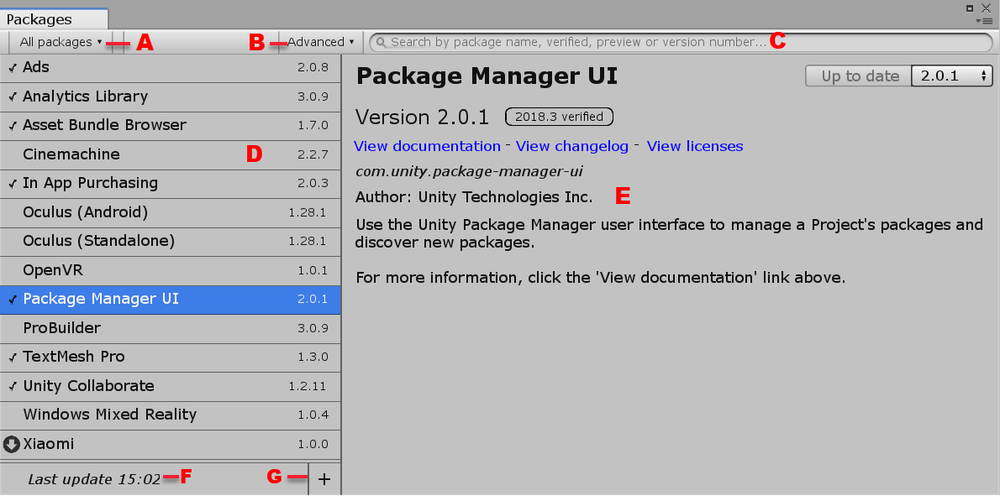
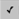
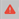
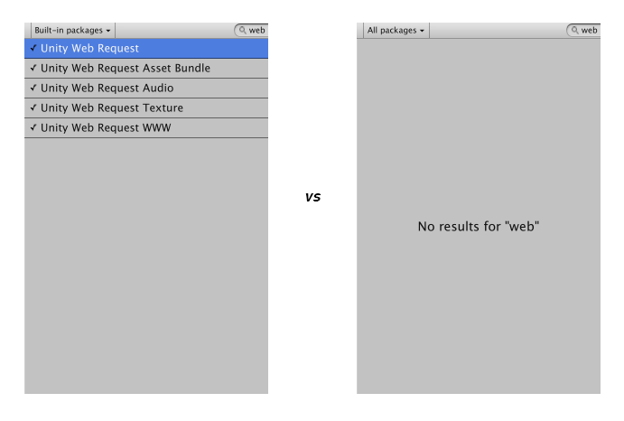
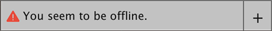
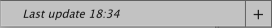
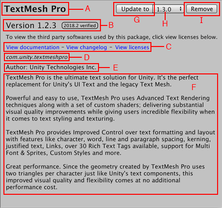
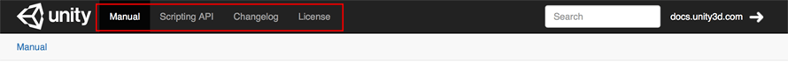
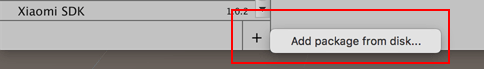

# Unity Package Manager

A package is a container that holds any combination of Assets, Shaders, Textures, plug-ins, icons, and scripts that enhance various parts of your Project, including Unity modules (such as Physics or Animation). Unity packages are newer, more tightly integrated versions of Asset Store packages, able to deliver a wide range of enhancements to Unity.

Use the Unity Package Manager (in Unity’s top menu: __Window__ > __Package Manager__) to view which packages are available for installation or already installed in your Project. In addition, you can use this window to see [which versions are available](#VersionList), and [install](#PackManInstall), [remove](#PackManRemove), [disable](#PackManDisable), or [update](#PackManUpdate) packages for each Project.

The Packages window displays:

- (A) The [package scope drop-down menu](#scope), which allows you to filter which packages appear in the list.
- (B) The [Advanced button](#advanced), which allows you to display preview packages in addition to packages that have been verified to work with Unity.
- (C) The [search box](#searchText), which allows you to look for packages by name.
- (D) The [packages list view](#PackManLists), which displays all packages that match the filter and search parameters you specify.
- (E) The [package-specific detail view](#PackManDetails), which displays information specific to the package selected in the list.
- (F) The [status bar](#statusbar), which displays messages about the package load status and warnings about the network.
- (G) The [Add package from disk button](#extpkg), which allows you to specify the location of an external package.

## Finding packages

The Packages window displays the following types of Unity packages:

- **Read-only packages**

  These are packages which the Package Manager downloads from the [Unity package registry](#PackManRegistry) as needed. They are not bundled with the Project source and may have dependencies on other packages in external Projects. This type is typical of most Unity packages.

- **Local packages**

  These are packages that you saved on your computer in an [external](#extpkg) location outside of your current Unity Project.

- **Built-in packages**

  These represent some of the core Unity features. You can use these packages to [turn Unity modules on and off](#PackManDisable).

**Note**: You can find out more about what each module implements in the [Unity Scripting API](https://docs.unity3d.com/ScriptReference/). Each module assembly page lists which APIs the built-in package implements.

By default, the Packages window displays the list of all packages either registered in the [package registry](#PackManRegistry) or installed [locally](#extpkg).

The following icons show you package status:

 A check mark indicates that the package is already [installed](#PackManInstall) or [enabled](#PackManDisable).

 The download icon indicates that the installed packages has [an available update](#PackManUpdate).

 An error icon indicates that something went wrong during installation or loading. For more advice on resolving errors, see [Error messages](#troubleshooting) below.

You can [filter](#scope) the list to display only packages installed in your Project (including [local](#extpkg) packages), or display only built-in Unity packages. You can also [search](#searchText) for a specific package by package name, tag, or package version number.

### Filtering the list

To change which packages appear in the list, select the scope you want from the drop-down menu in the left hand corner of the Packages window.

You can select from these options:

- The **All packages** scope (the default) displays all packages on the [package registry](#PackManRegistry), regardless of whether they are already installed in your Project. This also includes [local](#extpkg) packages (which are always installed).
- The **In Project** scope displays all packages currently installed in your Project, including [local](#extpkg) packages.
- The **Built-in packages** scope displays only built-in Unity packages.

When you select a new scope, your choice appears on the package scope drop-down menu and the list displays the packages matching your choice.

**Note:** If you entered any text in the [search box](#searchText), the list only displays packages which match both the scope and the search criteria.

### Advanced button

The **Advanced** button opens a drop-down menu that allows you to show preview packages. Preview package are not verified to work with Unity and might be unstable. They are not not supported in production environments.

To show the preview packages that are available, click the **Advanced** button, then click the **Show preview packages** menu item.

### Searching for packages

You can use the search box at the top of the Packages window to find any packages that match the text you enter. The Package Manager updates the package list as you enter text, displaying every package within the current scope that matches. For example, if you enter `web` in the search box, the list displays different results depending on whether you chose the **Built-in packages** scope or the **All packages** scope:

You can look for a package by its [package name](#PackManManifestsPackage), its [tag name](#version_tags), or its [package version number](#VersionList).  The Package Manager analyzes the text that you enter to detect which method you are using and updates the list of packages dynamically.

**Package name**

You can search for either the display name as it appears in the Packages window, or the registered package name that begins with `com.unity`.

Your search text could match the beginning, middle, or end of the package's name.

**Tag name**

To search by tag name, enter one of the package version tags. For example, if you enter `verified` in the search box, only packages with a verified tag appear, regardless of their package name.

**Version number**

Enter the [version number](#VersionList) in version order (`MAJOR.MINOR.PATCH`). For example, typing `1` returns all packages with versions matching `1.x.x` (for example, `1.0.0`, `1.3.2`, and `1.10.1` all match but not `0.1.0` ).

### Status bar

The Package Manager displays messages in the status bar at the bottom left of the Packages window.

There are typically three status messages that you might see. The **Loading packages** message appears briefly the first time you open Packman UI in a new Project. However, if the Package Manager [detects a problem](#troubleshooting), such as a missing network connection, the Package Manager displays a warning in the status bar:

You will also often see a message informing you when the last update occurred:

## Viewing package details

The pane on the right side of the Packages window displays details about the selected package.

These details include the following information:
 - (A) The display name
 - (B) The [version number](#VersionList) (and [tag](#version_tags), if available)
 - \(C\) The [links](#links) to open the package documentation page, the package change log (if available), and the license information.
 - (D) The official package name from the [registry](#PackManRegistry) starting with `com.unity.`
 - (E) The author
 - (F) A brief description
 - (G) Buttons to [install](#PackManInstall) or [update](#PackManUpdate) a package (or the **Up to date** message if the selected version is already installed)
 - (H) The package version drop-down menu
 - (I) Buttons to [remove](#PackManRemove) or [disable](#PackManDisable) the package

### List of versions

You can view the list of versions available for the current package by clicking the version drop-down menu beside the **Update to** or **Install** button in the upper right of the Package specific detail view.

- (A) The main menu displays the current version, the latest version (even if it is a preview), and the verified version.
- (B) The submenu displays all available versions.

You can select any of these versions for the current package and install that specific version using the **Install** or **Update to** button.

### Version tags

Some packages display tags next to the version number. These tags convey information about that version of the package.

The Package Manager uses the following values:

| **Tag** | **Meaning** |
|--|--|
| `Verified` | This package has been verified by Unity's Quality Assurance team to work with a specific version of the Editor. |
| `Preview` | This package is at an early stage of the release cycle and may not have been documented and fully validated by either the development team or Unity's Quality Assurance team. |
| `Local` | This package is located on your local disk but is external to your Unity Project folder. |
| *(no tag)* | This package is considered production quality, which means it is fully validated, documented, supported, and incrementally updated. |

### Finding more information

You can find out more about a package by viewing its documentation, changelog, or license information.

To access any of these pages, click the **View documentation**, **View changelog**, or **View licences** links.

The package page opens in your default browser.

To switch back and forth between the *Manual* documentation, the *Scripting API* documentation, the *Changelog*, and the *License* information for this package, click the corresponding link at the top of the page.

## Installing, removing, disabling, and updating packages
You can perform a variety of tasks through the Packages window:

 - [Install a new package](#PackManInstall)
 - [Remove an installed package](#PackManRemove)
 - [Disable a built-in package](#PackManDisable)
 - [Update an installed package](#PackManUpdate)
 - [Specify an external package location](#extpkg)

### Accessing the Packages window

To open the Packages window, navigate to Unity's main menu and go to **Window** > **Package Manager**.

### Installing a new package

To install a new package:

1.  Open the Packages window and select **All packages** from the [package scope](#scope) drop-down menu.
2.  Select the package you want to install from the [list of packages](#PackManLists). The package information appears in the [details pane](#PackManDetails).
3. Select the version you want from the [version drop-down menu](#VersionList).
4. Click the **Install** button. When the progress bar finishes, the new package is ready to use.

### Removing an installed package

You can only remove packages which are not required by another package.

When you remove a package, any Editor or run-time functionality which it implemented is no longer available.

To remove an installed package:

1. Open the Packages window and select **In Project** (or **All packages**) from the [package scope](#scope) drop-down menu.
2. Select the package you want to remove from the [list of packages](#PackManLists). The package information appears in the [details pane](#PackManDetails).
3. Click the **Remove** button. When the progress bar finishes, the package disappears from the list.

You can restore a removed package from the list when you are in the **All packages** scope.

### Disabling a built-in package

You can disable a built-in package if you don't need some modules and you want to save resources. However, when you disable a built-in package, the corresponding Unity functionality is no longer available. This results in the following:

- If you use a Scripting API implemented by a disabled package, you get compiler errors.
- Components implemented by the disabled built-in package are also disabled, which means you cannot add them to any GameObjects. If you have a GameObject that already has one of these components, Unity ignores them in Play mode. You can see them in the Inspector window but they are greyed out to indicate that they are not available.
- When building a game, Unity strips all disabled components. For build targets which support engine code stripping (like WebGL, iOS, and Android), Unity doesn't add any code from a disabled built-in package.

To disable a built-in package:
  1. Open the Packages window and select **Built-in packages** from the [package scope](#scope) drop-down menu.
  2. Select the package you want to remove from the [list of packages](#PackManLists). Its information appears in the Details pane.
  3. Click the **Disable** button. When the progress bar finishes, the check mark no longer appears next to the built-in package and the **Disable** button becomes an **Enable** button.

To re-enable a disabled built-in package, click the **Enable** button.

### Updating an installed package

You can update a package while in either the **In Project** or **All** mode:

1. Open the Packages window. An arrow indicator appears next to any packages that have updates available.
2. Select the package you want to update from the [list of packages](#PackManLists). The package information appears in the [details pane](#PackManDetails).
3. Select the version you want from the [version drop-down menu](#VersionList).
4. Click the **Update to** button.

When the progress bar finishes, the new package version information appears in the Details pane, and any new functionality is immediately available.

### Specifying a local package location

The Package Manager can load a package from anywhere on your computer even if you saved it outside your Unity Project folder. For example, if you have a package called `com.unity.my-local-package` and you save it on the `Desktop` but your Unity Project is under the `Documents` folder.

To load a package from your local disk:

1. Click the plus (`+`) icon in the status bar.

   The **Add package from disk** button appears.

   

2. Click the **Add package from disk** button to bring up a file browser.
3. Navigate to the folder root of your local package.
4. Double-click the `package.json` file in the file browser.

   The file browser closes and the package now appears in the [package list](#PackManLists) with the `local` tag.

## Error messages

The Package Manager displays error indicators when it encounters problems:

- **System-wide issues**

  Error messages that appear in the [status bar](#statusbar) indicate the Package Manager has detected an issue that is not related to a specific package. For example, if the Package Manager cannot access the [package registry server](#PackManRegistry), it displays this message in the status bar:

  

  If your network cannot reach the package registry server, it is probably because there is a connection problem with the network. When you or your system administrator fix the network error, the status bar clears.

- **Package-specific issues**

  If a specific package has a problem when loading or installing, the error icon () appears in the [package list](#PackManLists) next to the compromised package. To find out what the problem is, open the compromised package's [details pane](#PackManDetails).

## Understanding how packages work

In addition to its contents (Assets, Shaders, Textures, plug-ins, icons, and scripts), a Unity package contains a [package manifest file](#PackManManifestsPackage). The package manifest tells Unity how to display its information page in the Packages window, and how to install the package in the Project.

It also contains several files that help manage package deployment, including the tests, samples, license, changelog, and documentation.

### Manifests

There are two types of manifest files: [Project](#PackManManifestsProject) manifests (`manifest.json`), and [package](#PackManManifestsPackage) manifests (`package.json`). Both files use JSON (JavaScript Object Notation) syntax to communicate with the Package Manager, by describing which packages are available for each Project, and what each package contains.

#### Project manifests

Project manifests (`manifest.json`) tell the Package Manager which packages and versions are available to the Project.

Project manifests support the following value:

| Key | JSON Type | Description |
|--|--|--|
| `dependencies` | Object |List of packages for the Package Manager to load. These are usually packages officially registered with Unity, but may also include [local packages that are external](#extpkg) to your Unity project. |

Example of a `manifest.json` file:

	{
		"dependencies": {
			"com.unity.package-1": "1.0.0",
			"com.unity.package-2": "2.0.0",
			"com.unity.package-3": "3.0.0",
			"com.unity.my-local-package": "file:/<external_path>/com.unity.my-local-package"
		}
	}

Unity stores each Project manifest in the `[your_Project_root_folder]/Packages/manifest.json` file.

#### Package manifests

The Package Manager uses package manifests (`package.json`) to determine which version of the package to load, and what information to display in the Packages window.

Package manifests support the following values:

| Key | JSON Type | Description |
|--|--|--|
| `name` | String |The officially registered package name, following this naming convention: `"com.unity.[package name]"`. For example, `"com.unity.resourcemanager"` |
| `displayName` | String |The package name as it appears in the Packages window. For example, `"Resource Manager"` |
| `version` | String |The package version `"MAJOR.MINOR.PATCH"`. Unity packages follow the [Semantic Versioning](https://semver.org) system. For example, `"1.3.0"`. |
| `unity` | String |The Unity version that supports this package. For example, `"2018.1"` indicates compatibility starting with Unity version 2018.1. |
| `description` | String |A brief description of the package. This is the text that appears on the Details pane of the Packages window. Some special formatting character codes are supported, such as line breaks (`\n`) and bullets (`\u25AA`). |
| `category` | String |The category this packages is in. For example, `"Forces"`. |
| `dependencies` | Object |A list of packages that this package depends on, expressed as a JSON dictionary where the key is the package name and the value is the version number. Unity downloads all dependencies and loads them into the project alongside this package. |

Example of a `package.json` file:

	{
		"name": "com.unity.package-4",
		"displayName": "Package Number 4",
		"version": "2.5.1",
		"unity": "2018.2",
		"description": "This package provides X, Y, and Z. \n\nTo find out more, click the \"View documentation\" link.",
		"keywords": ["key X", "key Y", "key Z"],
		"category": "Controllers",
		"dependencies": {
			"com.unity.package-1": "1.0.0",
			"com.unity.package-2": "2.0.0",
			"com.unity.package-3": "3.0.0"
		}
	}

Unity stores each package manifest in the `[package_root_folder]/package.json` file.

### Package registry

Unity maintains a central registry of official packages that are available for distribution. When Unity loads, the Package Manager communicates with the registry, checks the Project manifest file, and displays the status of each available package in the Packages window.

When you remove a package from the Project, the Package Manager updates the Project manifest to exclude that package from the list when in **In Project** mode but it is still available in **All packages** mode because it is still in the registry.

When you install or update a package, the Package Manager downloads the package from the registry.

# Technical details

## Requirements

This version of Unity Package Manager is compatible with the following versions of the Unity Editor:

* 2018.3 and later (recommended)

## Documentation revision history
|Date|Reason|
|---|---|
|October 3, 2018|Documentation updated. Image updates and minor corrections.|
|September 14, 2018|Documentation updated. Matches package version 2.0.1.|
|June 4, 2018|Documentation updated. Matches package version 2.0.0.|
|May 25, 2018|Documentation updated. Matches package version 1.9.9.|
|May 4, 2018|Documentation updated. Matches package version 1.9.8.|
|March 19, 2018|Documentation updated. Matches package version 1.9.0.|
|Feb 8, 2018|Documentation updated. Matches package version 1.7.0.|
|Feb 6, 2018|Documentation cleaned up. Matches package version 1.6.1.|
|Jan 31, 2018|Documentation updated (developmental review)|
|Jan 29, 2018|Document updated. Matches package version 1.6.0.|
|Jan 18, 2018|Document updated. Matches package version 1.5.1.|
|Jan 17, 2018|Document updated. Matches package version 1.5.0.|
|Jan 12, 2018|Document updated. Matches package version 1.4.0.|
|Nov 7, 2017|Document created. Matches package version 1.0.0.|