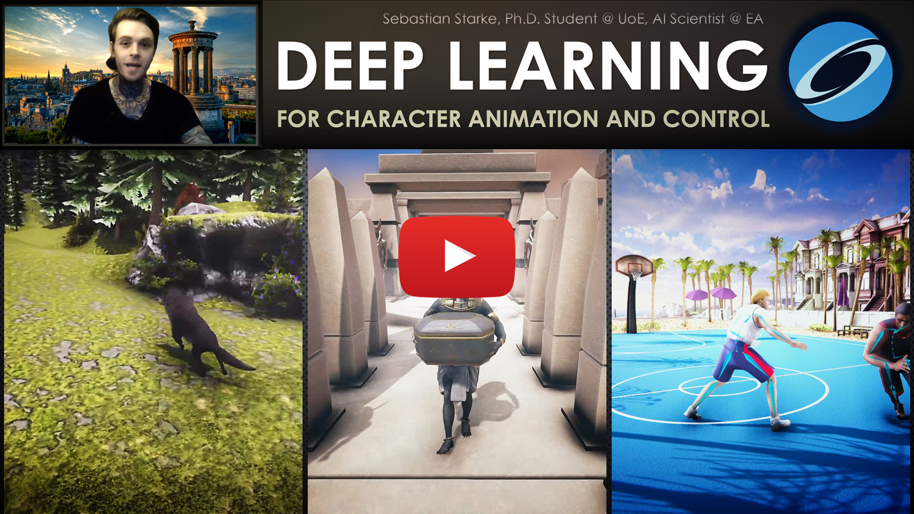
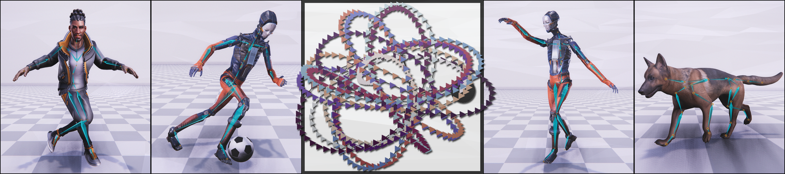
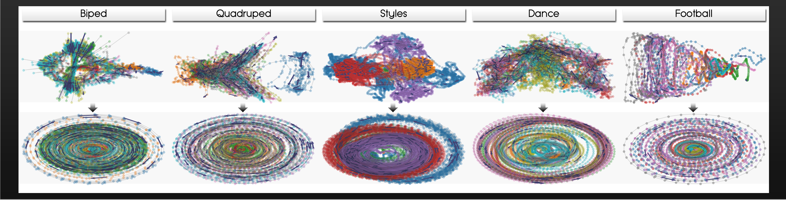
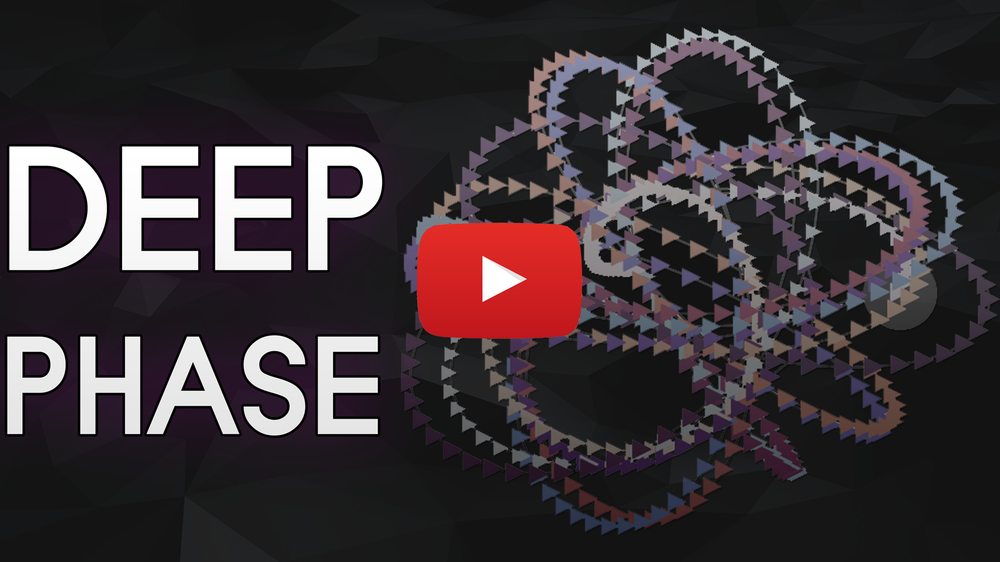
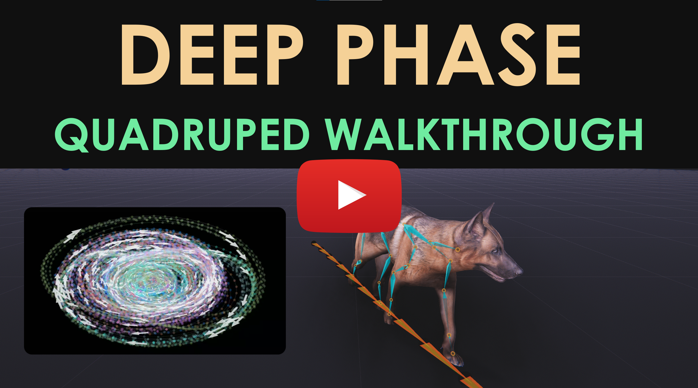
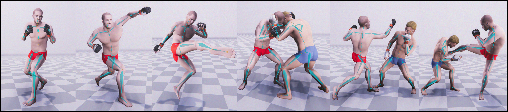
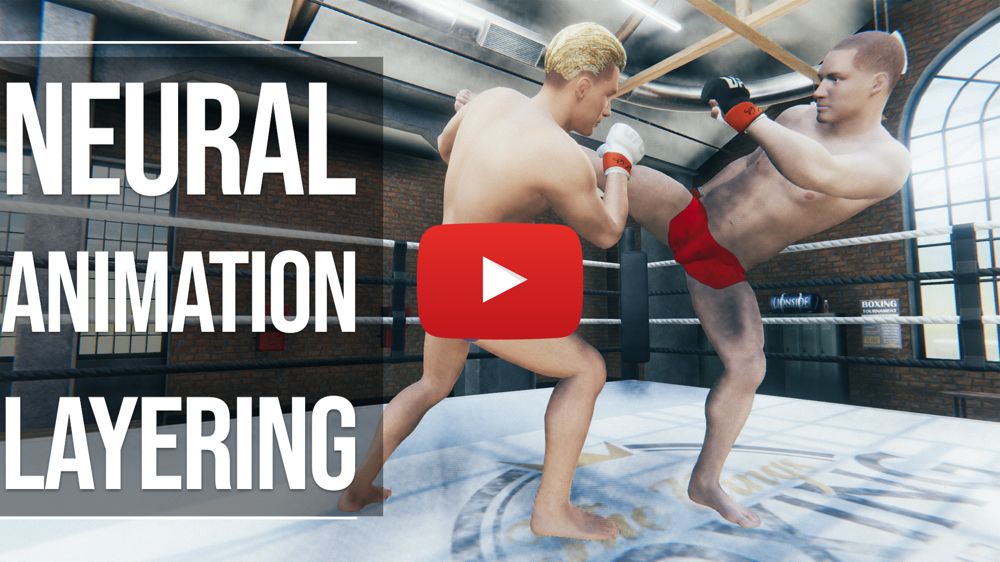
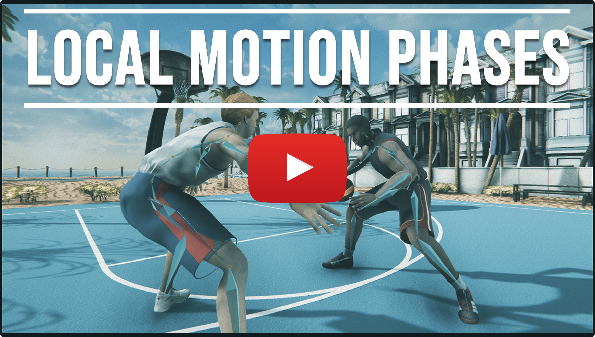
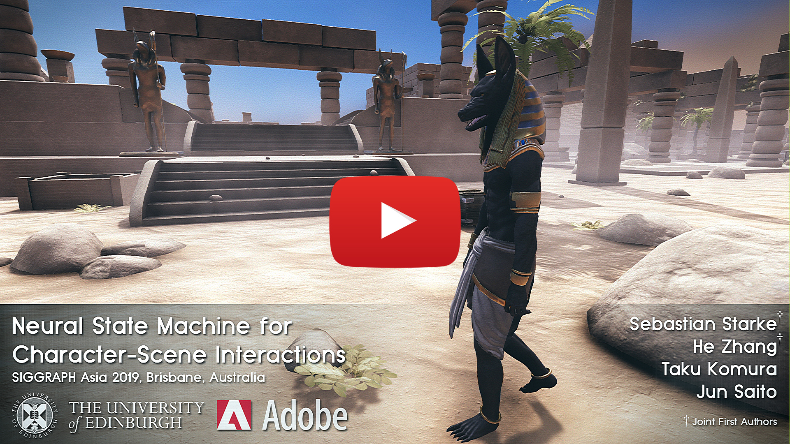
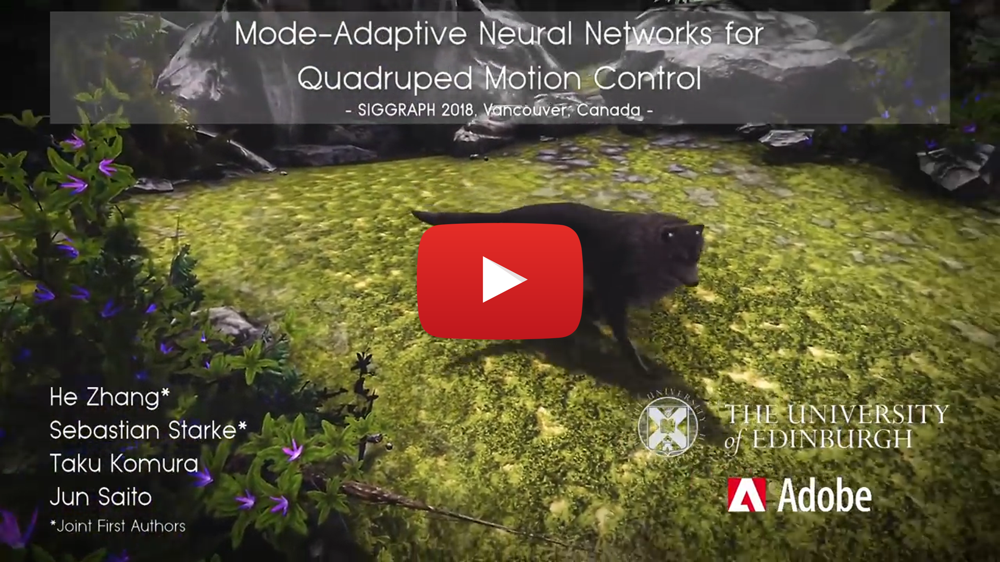

AI4Animation: Deep Learning for Character Control
============

This project explores the opportunities of deep learning for character animation and control as part of my Ph.D. research at the University of Edinburgh in the School of Informatics, supervised by <a href="http://homepages.inf.ed.ac.uk/tkomura">Taku Komura</a>. Over the last couple years, this project has become a comprehensive framework for data-driven character animation, including data processing, network training and runtime control, developed in Unity3D / Tensorflow / PyTorch. This repository demonstrates using neural networks for animating biped locomotion, quadruped locomotion, and character-scene interactions with objects and the environment, plus sports and fighting games. Further advances on this research will continue being added to this project.

------------
**SIGGRAPH 2022** 
**DeepPhase: Periodic Autoencoders for Learning Motion Phase Manifolds** 

<a href="https://www.linkedin.com/in/sebastian-starke-b281a6148/">Sebastian Starke</a>, 
<a href="https://www.linkedin.com/in/ian-mason-134197105/">Ian Mason</a>, 
<a href="https://www.linkedin.com/in/taku-komura-571b32b/">Taku Komura</a>, 
ACM Trans. Graph. 41, 4, Article 136.

------------

Learning the spatial-temporal structure of body movements is a fundamental problem for character motion synthesis. In this work, we propose a novel neural network architecture called the Periodic Autoencoder that can learn periodic features from large unstructured motion datasets in an unsupervised manner. The character movements are decomposed into multiple latent channels that capture the non-linear periodicity of different body segments while progressing forward in time. Our method extracts a multi-dimensional phase space from full-body motion data, which effectively clusters animations and produces a manifold in which computed feature distances provide a better similarity measure than in the original motion space to achieve better temporal and spatial alignment. We demonstrate that the learned periodic embedding can significantly help to improve neural motion synthesis in a number of tasks, including diverse locomotion skills, style-based movements, dance motion synthesis from music, synthesis of dribbling motions in football, and motion query for matching poses within large animation databases.

-
<a href="https://www.youtube.com/watch?v=YhH4PYEkVnY">Video</a>
-
<a href="Media/SIGGRAPH_2022/Paper.pdf">Paper</a>
-
<a href="AI4Animation/SIGGRAPH_2022/PyTorch">PAE Code & Demo</a>
-
<a href="AI4Animation/SIGGRAPH_2022/Unity">Animation Code & Demo</a>
-
<a href="https://www.ianxmason.com/posts/PAE/">Explanation and Addendum</a>
-
<a href="https://youtu.be/3ASGrxNDd0k">Tutorial</a>
-

    
    

-
<a href="https://github.com/pauzii/PhaseBetweener">Motion In-Betweening System</a>
-

------------
**SIGGRAPH 2021** 
**Neural Animation Layering for Synthesizing Martial Arts Movements** 

<a href="https://www.linkedin.com/in/sebastian-starke-b281a6148/">Sebastian Starke</a>, 
<a href="https://www.linkedin.com/in/evan-yiwei-zhao-18584a105/">Yiwei Zhao</a>, 
<a href="https://www.linkedin.com/in/fabio-zinno-1a77331/">Fabio Zinno</a>, 
<a href="https://www.linkedin.com/in/taku-komura-571b32b/">Taku Komura</a>, 
ACM Trans. Graph. 40, 4, Article 92.

------------

Interactively synthesizing novel combinations and variations of character movements from different motion skills is a key problem in computer animation. In this research, we propose a deep learning framework to produce a large variety of martial arts movements in a controllable manner from raw motion capture data. Our method imitates animation layering using neural networks with the aim to overcome typical challenges when mixing, blending and editing movements from unaligned motion sources. The system can be used for offline and online motion generation alike, provides an intuitive interface to integrate with animator workflows, and is relevant for real-time applications such as computer games.

-
<a href="https://www.youtube.com/watch?v=SkJNxLYNwN0">Video</a>
-
<a href="Media/SIGGRAPH_2021/Paper.pdf">Paper</a>
-

------------
**SIGGRAPH 2020** 
**Local Motion Phases for Learning Multi-Contact Character Movements** 

<a href="https://www.linkedin.com/in/sebastian-starke-b281a6148/">Sebastian Starke</a>, 
<a href="https://www.linkedin.com/in/evan-yiwei-zhao-18584a105/">Yiwei Zhao</a>, 
<a href="https://www.linkedin.com/in/taku-komura-571b32b/">Taku Komura</a>, 
<a href="https://www.linkedin.com/in/kazizaman/">Kazi Zaman</a>.
ACM Trans. Graph. 39, 4, Article 54.

------------

Not sure how to align complex character movements? Tired of phase labeling? Unclear how to squeeze everything into a single phase variable? Don't worry, a solution exists!

Controlling characters to perform a large variety of dynamic, fast-paced and quickly changing movements is a key challenge in character animation. In this research, we present a deep 
learning framework to interactively synthesize such animations in high quality, both from unstructured motion data and without any manual labeling. We introduce the concept of local 
motion phases, and show our system being able to produce various motion skills, such as ball dribbling and professional maneuvers in basketball plays, shooting, catching, avoidance, 
multiple locomotion modes as well as different character and object interactions, all generated under a unified framework.

-
<a href="https://www.youtube.com/watch?v=Rzj3k3yerDk">Video</a>
-
<a href="Media/SIGGRAPH_2020/Paper.pdf">Paper</a>
-
<a href="AI4Animation/SIGGRAPH_2020">Code</a>
-
<a href="https://www.starke-consult.de/AI4Animation/SIGGRAPH_2020/Demo_Windows.zip">Windows Demo</a>
-
<a href="AI4Animation/SIGGRAPH_2020/ReadMe.md">ReadMe</a>
-

------------
**SIGGRAPH Asia 2019** 
**Neural State Machine for Character-Scene Interactions** 

<a href="https://www.linkedin.com/in/sebastian-starke-b281a6148/">Sebastian Starke</a>+, 
<a href="https://www.linkedin.com/in/he-zhang-148467165/">He Zhang</a>+, 
<a href="https://www.linkedin.com/in/taku-komura-571b32b/">Taku Komura</a>, 
<a href="https://www.linkedin.com/in/jun-saito/">Jun Saito</a>. 
ACM Trans. Graph. 38, 6, Article 178.
 (+Joint First Authors)

------------

Animating characters can be an easy or difficult task - interacting with objects is one of the latter.
In this research, we present the Neural State Machine, a data-driven deep learning framework for character-scene interactions. The difficulty in such animations is that they require complex planning of periodic as well as aperiodic movements to complete a given task. Creating them in a production-ready quality is not straightforward and often very time-consuming. Instead, our system can synthesize different movements and scene interactions from motion capture data, and allows the user to seamlessly control the character in real-time from simple control commands. Since our model directly learns from the geometry, the motions can naturally adapt to variations in the scene. We show that our system can generate a large variety of movements, icluding locomotion, sitting on chairs, carrying boxes, opening doors and avoiding obstacles, all from a single model. The model is responsive, compact and scalable, and is the first of such frameworks to handle scene interaction tasks for data-driven character animation.

-
<a href="https://www.youtube.com/watch?v=7c6oQP1u2eQ">Video</a>
-
<a href="Media/SIGGRAPH_Asia_2019/Paper.pdf">Paper</a>
-
<a href="AI4Animation/SIGGRAPH_Asia_2019">Code & Demo</a>
-
<a href="https://www.starke-consult.de/AI4Animation/SIGGRAPH_Asia_2019/MotionCapture.zip">Mocap Data</a>
-
<a href="AI4Animation/SIGGRAPH_Asia_2019/ReadMe.md">ReadMe</a>
-

------------
**SIGGRAPH 2018** 
**Mode-Adaptive Neural Networks for Quadruped Motion Control** 

<a href="https://www.linkedin.com/in/he-zhang-148467165/">He Zhang</a>+, 
<a href="https://www.linkedin.com/in/sebastian-starke-b281a6148/">Sebastian Starke</a>+, 
<a href="https://www.linkedin.com/in/taku-komura-571b32b/">Taku Komura</a>, 
<a href="https://www.linkedin.com/in/jun-saito/">Jun Saito</a>. 
ACM Trans. Graph. 37, 4, Article 145.
 (+Joint First Authors)

------------

Animating characters can be a pain, especially those four-legged monsters!
This year, we will be presenting our recent research on quadruped animation and character control at the SIGGRAPH 2018 in Vancouver. The system can produce natural animations from real motion data using a novel neural network architecture, called Mode-Adaptive Neural Networks. Instead of optimising a fixed group of weights, the system learns to dynamically blend a group of weights into a further neural network, based on the current state of the character. That said, the system does not require labels for the phase or locomotion gaits, but can learn from unstructured motion capture data in an end-to-end fashion.

-
<a href="https://www.youtube.com/watch?v=uFJvRYtjQ4c">Video</a>
-
<a href="Media/SIGGRAPH_2018/Paper.pdf">Paper</a>
-
<a href="AI4Animation/SIGGRAPH_2018">Code</a>
-
<a href="https://www.starke-consult.de/AI4Animation/SIGGRAPH_2018/MotionCapture.zip">Mocap Data</a>
-
<a href="https://www.starke-consult.de/AI4Animation/SIGGRAPH_2018/Demo_Windows.zip">Windows Demo</a>
-
<a href="https://www.starke-consult.de/AI4Animation/SIGGRAPH_2018/Demo_Linux.zip">Linux Demo</a>
-
<a href="https://www.starke-consult.de/AI4Animation/SIGGRAPH_2018/Demo_Mac.zip">Mac Demo</a>
-
<a href="AI4Animation/SIGGRAPH_2018/ReadMe.md">ReadMe</a>
-

-
<a href="https://github.com/pauzii/AnimationAuthoring">Animation Authoring Tool</a>
-

------------
**SIGGRAPH 2017** 
**Phase-Functioned Neural Networks for Character Control** 

<a href="https://www.linkedin.com/in/daniel-holden-300b871b/">Daniel Holden</a>,
<a href="https://www.linkedin.com/in/taku-komura-571b32b/">Taku Komura</a>, 
<a href="https://www.linkedin.com/in/jun-saito/">Jun Saito</a>. 
ACM Trans. Graph. 36, 4, Article 42.

------------

This work continues the recent work on PFNN (Phase-Functioned Neural Networks) for character control.
A demo in Unity3D using the original weights for terrain-adaptive locomotion is contained in the Assets/Demo/SIGGRAPH_2017/Original folder.
Another demo on flat ground using the Adam character is contained in the Assets/Demo/SIGGRAPH_2017/Adam folder.
In order to run them, you need to download the neural network weights from the link provided in the Link.txt file, extract them into the /NN folder, 
and store the parameters via the custom inspector button.

-
<a href="https://www.youtube.com/watch?v=Ul0Gilv5wvY">Video</a>
-
<a href="http://theorangeduck.com/media/uploads/other_stuff/phasefunction.pdf">Paper</a>
-
<a href="AI4Animation/SIGGRAPH_2017">Code (Unity)</a>
-
<a href="https://www.starke-consult.de/AI4Animation/SIGGRAPH_2017/Demo_Windows.zip">Windows Demo</a>
-
<a href="https://www.starke-consult.de/AI4Animation/SIGGRAPH_2017/Demo_Linux.zip">Linux Demo</a>
-
<a href="https://www.starke-consult.de/AI4Animation/SIGGRAPH_2017/Demo_Mac.zip">Mac Demo</a>
-

------------

Processing Pipeline
============
In progress. More information will be added soon.

Copyright Information
============
This project is only for research or education purposes, and not freely available for commercial use or redistribution. The motion capture data is available only under the terms of the [Attribution-NonCommercial 4.0 International](https://creativecommons.org/licenses/by-nc/4.0/legalcode) (CC BY-NC 4.0) license.
